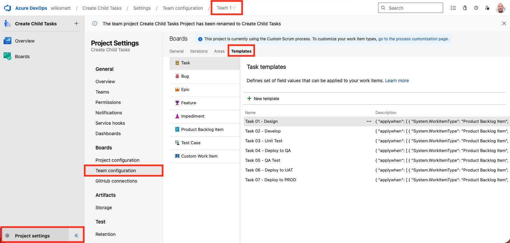
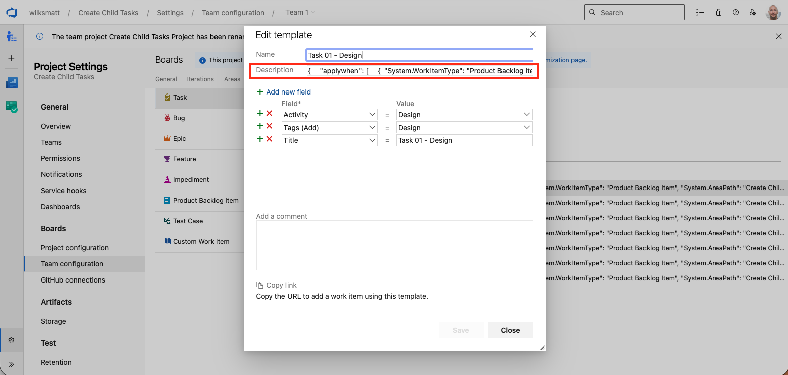
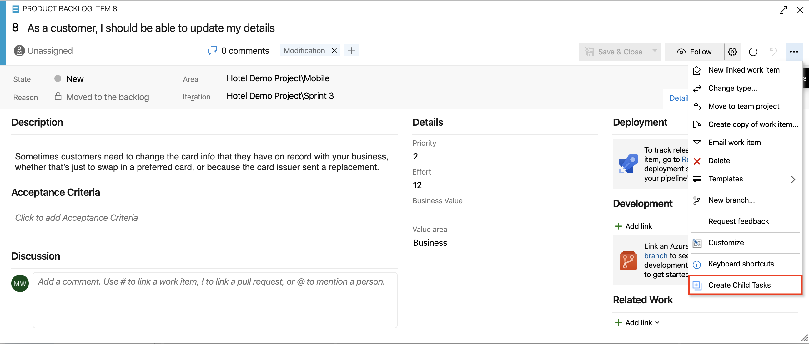
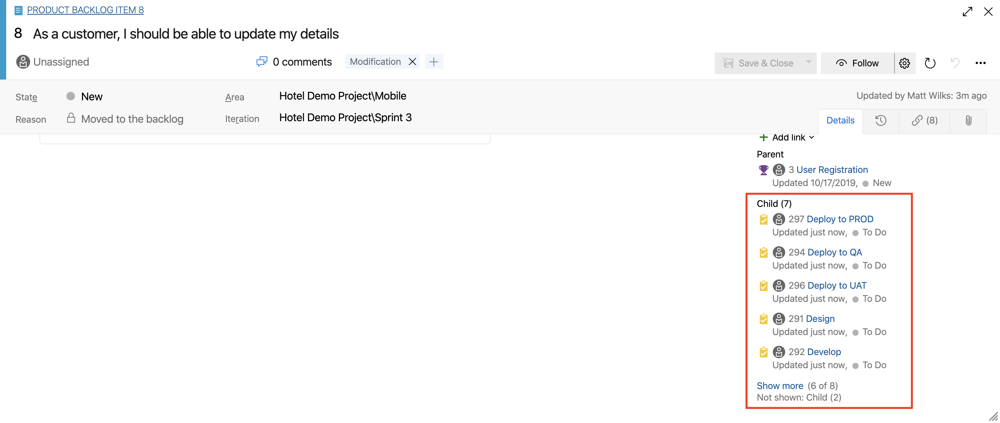
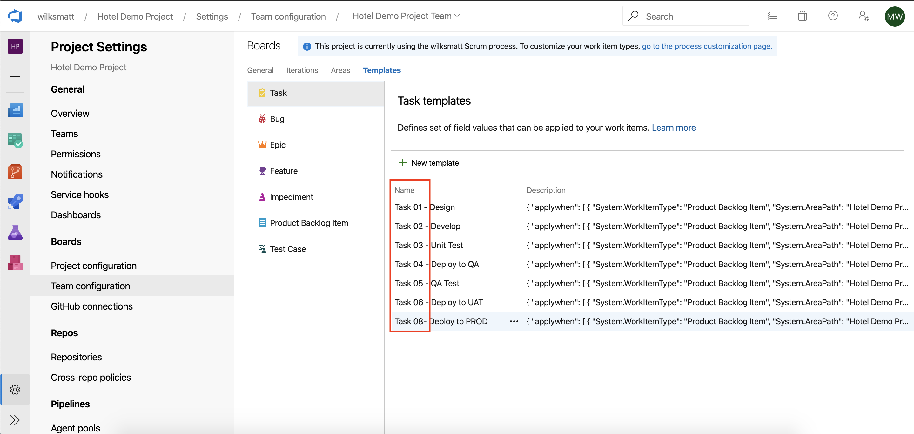
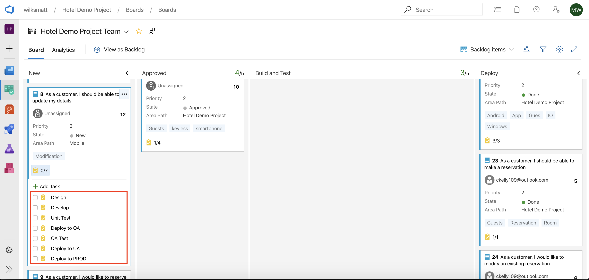

## Create Child Tasks ##

Azure DevOps offers team-specific work item templating as <a href="https://docs.microsoft.com/en-us/azure/devops/boards/backlogs/work-item-template?view=azure-devops&tabs=browser" target="_blank">core functionality</a> with which you can quickly apply pre-populated values for your team's commonly used fields per work item type. **Create Child Tasks** is an *extension* to Azure DevOps, which allows you to create multiple Task work items as children with a single click. Each Task work item is based on a single pre-defined Task template.

The child Task work items created by this extension are based on the hierarchy of work item types defined in the process template (<a href="https://docs.microsoft.com/en-us/azure/devops/boards/work-items/guidance/agile-process-workflow?view=azure-devops" target="_blank">Agile</a>, <a href="https://docs.microsoft.com/en-us/azure/devops/boards/work-items/guidance/scrum-process-workflow?view=azure-devops" target="_blank">Scrum</a>, <a href="https://docs.microsoft.com/en-us/azure/devops/boards/work-items/guidance/cmmi-process-workflow?view=azure-devops" target="_blank">CMMI</a>). For example, if you're using a process inherited from the agile template with a custom requirement-level type called defect and 3 Task templates defined, using this extension on a User Story or Defect work item will generate three child Tasks; one for each defined template.

## How-To Guide ##

### Defining Task Templates ###

Azure DevOps offers team-specific work item templating as core functionality with which you can quickly apply pre-populated values for your team's commonly used fields per work item type. View Microsoft's documentation about <a href="https://docs.microsoft.com/en-us/azure/devops/boards/backlogs/work-item-template" target="_blank">how to add and update work item templates</a>.



### Creating Task Template Filter Rules ###

With this extension, it's possible to specify which parent work items apply to each Task template by putting rules into the Task template *Description* field. There are two ways that you can specify these rules:



#### Basic ####

Put the list of applicable parent work item types in the child Task template's description field, like this:

```[Product Backlog Item, Bug]```

#### Advanced ####

Put a minified (single line) JSON string into the child Task template's description field, like this:

``` json
{
    "applywhen": [
    {
        "System.State": "Approved",
        "System.Tags" : ["Blah", "ClickMe"],
        "System.WorkItemType": "Product Backlog Item",
        "System.AreaPath": "Root\\Sub Path\\Another Sub Path"
    },
    {
        "System.BoardColumn": "Testing",
        "System.BoardLane": "Expedite",
        "System.State": "Custom State",
        "System.Title": "Repeatable item",
        "System.WorkItemType": "Custom Type"
    }]
}
```

### Applying Child Tasks ###

Find and select the *Create Child Tasks* option on the toolbar menu of the parent work item (E.g. Product Backlog Item, User Story, Bug).



You should now have children associated with the open work item.



### Ordering Child Tasks ###

By default, the child Tasks are created and orderd alphabetically by the Task template *name* field. If you would like to customize the order of how the tasks show up in the work item then you can name the Task template with numbers. 



When creating the tasks with the extension, the tasks will then show up in the same order in the work item.



### Using 'Wildcards' for Title Filter Rules ###

You might want to apply a child task to a parent work item if the parent work item *title* matches *completely* or only *partially*. It's possible to compare the parent work item *title* by using a *wildcard* string as the filter rule and using the asterick character ("*").

``` json
{
    "applywhen": [
    {
        "System.WorkItemType": "Product Backlog Item",
        "System.Title": "*WildcardString*"
    }]
}
```

The following are examples of how the wildcard comparison can be used:

```
- "a*b"     Everything that starts with "a" and ends with "b"
- "a*"      Everything that starts with "a"
- "*b"      Everything that ends with "b"
- "*a*"     Everything that has an "a" in it
- "*a*b*"   Everything that has an "a" in it, followed by anything, followed by a "b", followed by anything
```

## Usage ##

### Prerequisites

- Node.js 16.x and npm (recommended for TFX/VSS SDK compatibility)
    - Check: `node -v`, `npm -v`
- Global tools: `npm install -g grunt-cli tfx-cli`
- Azure DevOps organization with permission to install extensions
- Personal Access Token (PAT) with Marketplace (Publish) scope

Notes:
- Run project commands from the `src` folder (that’s where `package.json` and `Gruntfile.js` live).

### Install dependencies

```bash
cd src
npm install
```

### Build (VSIX package)

- Development build:
```bash
grunt package-dev
```
- Release build:
```bash
grunt package-release
```
Output is written to `../dist/*.vsix`.

### Publish to Marketplace

There are two supported flows for publishing the extension: a development (interactive) publish and a release (manual) publish. The development flow uses the convenience grunt task; the release flow produces a packaged VSIX that you upload manually to the Marketplace to avoid accidental public releases.

#### Development (interactive)

Use the Grunt task that prompts for a PAT and stores it locally for reuse:

```bash
# Interactive publish for development
grunt publish-dev
```

- If no token is saved, the task will prompt for a Personal Access Token (PAT) and save it to a local .env (ignored by git).
- Subsequent runs reuse the saved token. To change the token, remove or edit the .env and re-run `grunt publish-dev`.
- For non-interactive CI, set VSS_EXTENSION_PAT in the environment so the task runs without prompting.

#### Release (package and manual upload)

For a release publish, produce a production VSIX and upload it manually:

```bash
# Build release VSIX (outputs to ../dist/*.vsix)
grunt package-release
```

- This creates the release distribution file (../dist/*.vsix). Manually upload that VSIX to the Visual Studio Marketplace (your publisher account) via the Marketplace publisher portal.
- Manual upload prevents accidental public releases; use this flow when you want an explicit, reviewed release.
- If automating releases in CI, use caution — prefer explicit approvals or gated pipelines. Automated publish can be done with tfx or environment PATs but is not recommended unless you have release controls in place.

Notes:
- Development publishes are convenient for testing and iterating; release publishes are deliberate and manual to reduce risk of accidental public publishing.
- Ensure your PAT has the necessary Marketplace/Publish scopes for the chosen flow.

### Local debug with webpack dev server

1) Ensure the dev override points to the local server:
```json
// src/configs/dev.json
{
    "id": "create-child-tasks-test",
    "name": "Create Child Tasks (Test)",
    "public": false,
    "baseUri": "https://localhost:3000"
}
```

2) Start the dev server (from `src`):
```bash
npm run serve
```
- First run may require visiting `https://localhost:3000` in your browser to trust the self-signed certificate.
- Stop the server with Ctrl+C.

3) Install and use the dev extension in your ADO org.
- The extension iframe will load your pages from `https://localhost:3000`, enabling live reload and source maps.

### Using the extension in ADO

- Open a parent work item (e.g., User Story/PBI/Bug).
- Choose “Create Child Tasks” from the toolbar.
- Child items are created from team templates based on your template rules.

### Grunt tasks

- `package-dev` — Builds the development VSIX
- `package-release` — Builds the production VSIX
- `publish-dev` – Publishes the development VSIX

### Troubleshooting

- `tfx` missing or outdated: `npm install -g tfx-cli`
- Publish hangs: supply the PAT via `--token` or `VSS_EXTENSION_PAT`; avoid interactive prompts
- Node version issues with older tooling: use Node 16.x (e.g., `nvm install 16 && nvm use 16`)
- Trust HTTPS cert: open `https://localhost:3000` once and accept the certificate
- Stop webpack dev server: Ctrl+C; or kill by port 3000 (`lsof -nP -iTCP:3000 -sTCP:LISTEN` then `kill <PID>`)

## Credits ##

Cloned from https://github.com/figueiredorui/1-click-child-links
